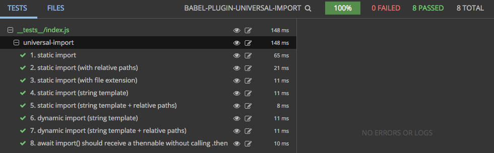

<a href="https://gitter.im/Reactlandia/Lobby" target="_blank">
  
</a>

# babel-plugin-universal-import

<p align="center">
  <a href="https://www.npmjs.com/package/babel-plugin-universal-import">
    
  </a>

  <a href="https://travis-ci.org/faceyspacey/babel-plugin-universal-import">
    
  </a>

  <a href="https://lima.codeclimate.com/github/faceyspacey/babel-plugin-universal-import/coverage">
    
  </a>

  <a href="https://greenkeeper.io">
    
  </a>

  <a href="https://lima.codeclimate.com/github/faceyspacey/babel-plugin-universal-import">
    
  </a>

  <a href="https://www.npmjs.com/package/babel-plugin-universal-import">
    
  </a>

  <a href="https://www.npmjs.com/package/babel-plugin-universal-import">
    
  </a>
</p>


<p align="center">
  
</p>

## Installation
```
yarn add babel-plugin-universal-import
```
*.babelrc:*
```js
{
  "plugins": ["universal-import"]
}
```


## What it does
Taking from the [test snapshots](./__tests__/__snapshots__/index.js.snap), it does this:

```js
import universal from 'react-universal-component'
const UniversalComponent = universal(import('./Foo.js'))

<UniversalComponent />

      ↓ ↓ ↓ ↓ ↓ ↓

import universal from 'react-universal-component'
import universalImport from 'babel-plugin-universal-import/universalImport.js'
import importCss from 'babel-plugin-universal-import/importCss.js'
import path from 'path'

const UniversalComponent = universal(universalImport({
  chunkName: () => 'Foo',
  path: () => path.join(__dirname, './Foo.js'),
  resolve: () => require.resolveWeak('./Foo.js'),
  load: () => Promise.all([
    import( /* webpackChunkName: 'Foo' */ './Foo.js'),
    importCss('Foo')
  ]).then(proms => proms[0])
}))

<UniversalComponent />
```

And if you're using dynamic imports:

```js
import universal from 'react-universal-component'
const UniversalComponent = universal(props => import(`./${props.page}`))

<UniversalComponent page='Foo' />

      ↓ ↓ ↓ ↓ ↓ ↓

import universal from 'react-universal-component'
import universalImport from 'babel-plugin-universal-import/universalImport.js'
import importCss from 'babel-plugin-universal-import/importCss.js'
import path from 'path'

const UniversalComponent = universal(props => universalImport({
  chunkName: props => props.page,
  path: props => path.join(__dirname, `./${props.page}`),
  resolve: props => require.resolveWeak(`./${props.page}`),
  load: props => Promise.all([
    import( /* webpackChunkName: '[request]' */ `./${props.page}`),
    importCss(props.page)
  ]).then(proms => proms[0])
}));

<UniversalComponent page='Foo' />
```
> NOTE: if you aren't using `react-universal-component` and you just want to serve CSS chunks from [extract-css-chunks-webpack-plugin](https://github.com/faceyspacey/extract-css-chunks-webpack-plugin), use [babel-plugin-dual-import](https://github.com/faceyspacey/babel-plugin-universal-import) instead.

It names all your chunks using *magic comments* 🔮 behind the scenes and is derived from the imported file. This works with both static and dynamic import paths, as you can see above.

Otherwise, what it's doing is providing all the different types of requires/paths/imports/etc needed by tools like [react-universal-component](https://github.com/faceyspacey/react-universal-component) to universally render your component.

The targeted **use-case** for all this is dynamic imports where you can pass a `page` prop to the resulting component, thereby allowing you to create one `<UniversalComponent page={page} />` for a large number of your components. This is a major upgrade to the previous way of having to make a hash of a million async components in a wrapping component. You no longer have to think about *Universal Components* as anything different than your other components that use simple HoCs.

Perhaps the most powerful part however is that it also attempts to import a separate CSS file along with js chunks for optimum chunk sizes, caching and performance. Look in what `Promise.all` does. To fulfill this mission you must be using [extract-css-chunks-webpack-plugin](https://github.com/faceyspacey/extract-css-chunks-webpack-plugin) to create multiple CSS chunks for dynamic imports.

And maybe even *cooler* to some: you don't have to do `universal(() => import())`. I.e. you don't have to wrap it in a function any longer when using `react-universal-component`, similar to `dynamic(import())` in Next.js...*unless of course you're making use of the extremely useful `props` argument.*

## Typescript and non-Babel environments

If you can't use babel, you can either copy what this plugin does above, or you can do a shorter version where you just put the important configuration key/vals on the 2nd options argument to `universal`:

```js
import universal from 'react-universal-component'
import importCss from 'babel-plugin-universal-import/importCss.js'

const load = props => Promise.all([
    import( /* webpackChunkName: '[request]' */ `./${props.page}`),
    importCss(props.page)
  ]).then(proms => proms[0])

const UniversalComponent = universal(load, {
  chunkName: props => props.page,
  resolve: props => require.resolveWeak(`./${props.page}`)
});
```
> notice `chunkName` and `resolve` as standard options on the 2nd options argument.

## Babel Server Or Webpack < 2.2.20

If your compiling the server with Babel, set the following option so `import()` does not exist in the final compilation result server-side:

```js
{
  "plugins": [
    ["universal-import", {
      "babelServer": true
    }]
  ]
}
```

## Supressing console warnings

When navigating across pages, warnings will be displayed to alert you about any potential missing CSS chunks. If you're not using the CSS functionality of this plugin or just want to keep your console clean, use the `disableWarnings` option like so:

```js
{
  "plugins": [
    ["universal-import", {
      "disableWarnings": true
    }]
  ]
}
```

## Next Steps

Checkout the rest of the packages in the *"Universal"* family:
- [webpack-flush-chunks](https://github.com/faceyspacey/webpack-flush-chunks)
- [react-universal-component](https://github.com/faceyspacey/react-universal-component)
- [extract-css-chunks-webpack-plugin](https://github.com/faceyspacey/extract-css-chunks-webpack-plugin)

*We realize things are bit confusing right now because of the shear number of packages. The next release is called `universal-render` and will bring everything under one roof, while adding a few final tricks. You heard it here first.*

## Caveat
- For chunks to be properly created--and since their names are automatically generated for you--you can't have different chunks with the same name, say `index`. So instead of ```import(`./index`)```, make your imports like this: ```import(`../ComponentFolderA`)``` and ```import(`../ComponentFolderB`)```. Notice you're going back one directory--this allows the chunk name to be generated uniquely even though the entry point file is `index.js` for both components. In addition, if in multiple places you import the same module, make sure they both start with the same base directory name. **Again, using `..` is your friend. Initial dots and slashes will be stripped from the resulting chunk name.**

- To the discerning eye, you may be wondering if the return of `import()` is still *thenable*?? It is! However, if you don't call `.then` on it, somewhere (perhaps in the components like *react-universal-component* that you pass it to), then it won't perform the import. Since most of us are using modules, which we need to do something with in the `then` callback, that's not a problem. But if you happen to be importing a module that does its own setup, such as attaches something to the `window` object, well then you just need to call `.then()` to trigger it. That's a rare case these days, which is why we decided to go with the simplicity seen here. And yes, async await works too.

## Contributing

We use [commitizen](https://github.com/commitizen/cz-cli), so run `npm run cm` to make commits. A command-line form will appear, requiring you answer a few questions to automatically produce a nicely formatted commit. Releases, semantic version numbers, tags, changelogs and publishing to NPM will automatically be handled based on these commits thanks to [semantic-release](https://github.com/semantic-release/semantic-release). Be good.


## Tests

Reviewing a package's tests are a great way to get familiar with it. It's direct insight into the capabilities of the given package (if the tests are thorough). What's even better is a screenshot of the tests neatly organized and grouped (you know the whole "a picture says a thousand words" thing).

Below is a screenshot of this module's tests running in [Wallaby](https://wallabyjs.com) *("An Integrated Continuous Testing Tool for JavaScript")* which everyone in the React community should be using. It's fantastic and has taken my entire workflow to the next level. It re-runs your tests on every change along with comprehensive logging, bi-directional linking to your IDE, in-line code coverage indicators, **and even snapshot comparisons + updates for Jest!** I requestsed that feature by the way :). It's basically a substitute for live-coding that inspires you to test along your journey.




## More from FaceySpacey in Reactlandia
- [redux-first-router](https://github.com/faceyspacey/redux-first-router). It's made to work perfectly with *Universal*. Together they comprise our *"frameworkless"* Redux-based approach to what Next.js does (splitting, SSR, prefetching, routing).
